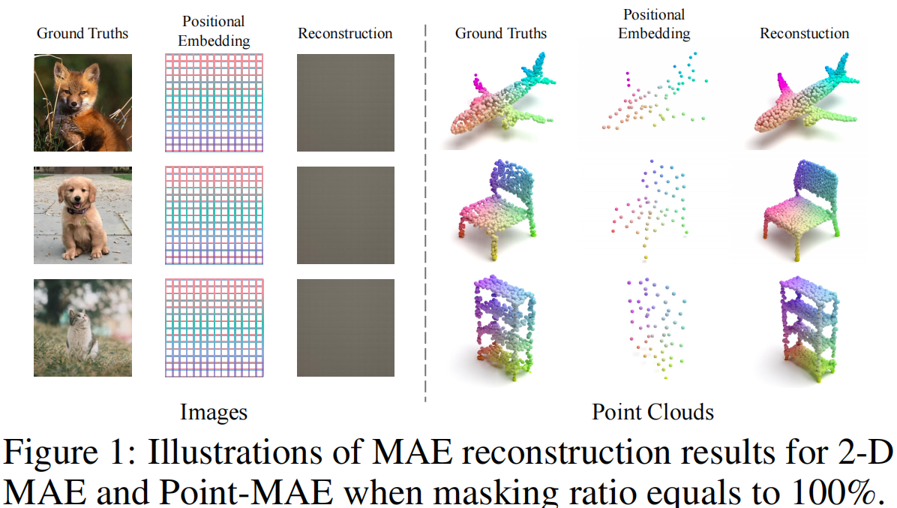
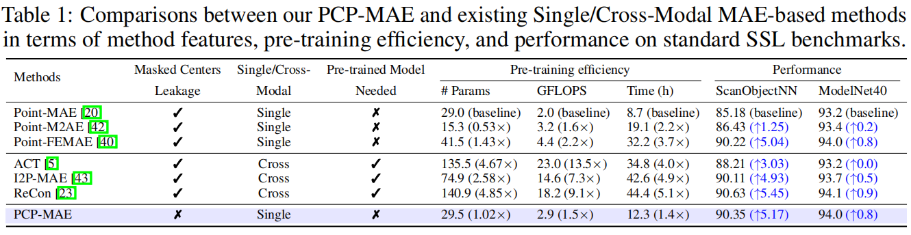

# PCP-MAE (NeurIPS 2024 Spotlight)

[](https://paperswithcode.com/sota/3d-point-cloud-classification-on-scanobjectnn?p=pcp-mae-learning-to-predict-centers-for-point)
[](https://paperswithcode.com/sota/few-shot-3d-point-cloud-classification-on-1?p=pcp-mae-learning-to-predict-centers-for-point)
[](https://paperswithcode.com/sota/few-shot-3d-point-cloud-classification-on-2?p=pcp-mae-learning-to-predict-centers-for-point)
[](https://paperswithcode.com/sota/few-shot-3d-point-cloud-classification-on-3?p=pcp-mae-learning-to-predict-centers-for-point)
[](https://paperswithcode.com/sota/few-shot-3d-point-cloud-classification-on-4?p=pcp-mae-learning-to-predict-centers-for-point)

> [**PCP-MAE: Learning to Predict Centers for Point Masked Autoencoders**](https://arxiv.org/abs/2408.08753) **NeurIPS 2024 spotlight** <br>
> [Xiangdong Zhang](https://scholar.google.com/citations?user=5S-TKKoAAAAJ&hl=zh-CN&oi=sra)\*, [Shaofeng Zhang](https://scholar.google.com/citations?user=VoVVJIgAAAAJ&hl=zh-CN&oi=sra)\* and [Junchi Yan](https://scholar.google.com/citations?user=ga230VoAAAAJ&hl=zh-CN&oi=sra) <br> 
<!-- [Arxiv](https://arxiv.org/abs/2408.08753)  -->

</h2>
<h5 align="center"> If you like our project, please give us a star ⭐ on GitHub for the latest update.  </h2>


## PCP-MAE: Learning to Predict Centers for Point Masked Autoencoders

<div  align="center">    
 
 <p>Figure 1: Overview of the proposed PCP-MAE.</p>
</div>

## 📰 News

<!-- - 🍾 Oct, 2024: The corresponding checkpoints are released. -->
<!-- - 📌 Oct, 2024: The training and inference code is released. -->
- 💥 Aug, 2024: PCP-MAE is available in [arxiv](https://arxiv.org/abs/2408.08753).
- 🎉 Sept, 2024: [**PCP-MAE**](https://arxiv.org/abs/2408.08753) is accepted by NeurIPS 2024 as **spotlight**.
- 📌 Oct, 2024: The corresponding checkpoints are released in [Google Drive](https://drive.google.com/drive/folders/18E04xV5r4GtjhLGJIc9Ulo1F5DuOTYU6?usp=drive_link) and the code will be coming soon.
- 📌 Oct, 2024: The code has been released.
- 💡 Nov, 2024: The introduction to PCP-MAE is added.


## ✅ TODO List
- [x] Complete the introduction for the PCP-MAE project.
- [x] Publish the training and inference code.
- [x] Release the checkpoints for pre-training and finetuning.

## 🔍 Introduction
<!-- Masked autoencoder has been widely explored in point cloud self-supervised learning, whereby the point cloud is generally divided into visible and masked parts. These methods typically include an encoder accepting visible patches (normalized) and corresponding patch centers (position) as input, with the decoder accepting the output of the encoder and the centers (position) of the masked parts to reconstruct each point in the masked patches. Then, the pre-trained encoders are used for downstream tasks.  -->

In this paper, we show a motivating empirical result that **when directly feeding the centers of masked patches to the decoder without information from the encoder, it still reconstructs well.** In other words, the centers of patches are important and the reconstruction objective does not necessarily rely on representations of the encoder, thus preventing the encoder from learning semantic representations. 

**In short, the [2D MAE](https://arxiv.org/pdf/2111.06377) and [Point-MAE](https://www.ecva.net/papers/eccv_2022/papers_ECCV/papers/136620591.pdf) differ in several aspects, as shown in the figure below.** Therefore, it is inappropriate to directly transfer 2D MAE operations to the 3D domain.

<div align="center">
    
    <p>Figure 2: When the encoder in Point-MAE is removed, the point cloud can still be reconstructed.</p>
</div>

Based on this key observation, we propose a simple yet effective method, i.e., learning to Predict Centers for Point Masked AutoEncoders (**PCP-MAE**) which guides the model to learn to predict the significant centers and use the predicted centers to replace the directly provided centers. 
<!-- Specifically, we propose a Predicting Center Module (PCM) that shares parameters with the original encoder with extra cross-attention to predict centers.  -->

Our method is of **high pre-training efficiency** compared to other alternatives and **achieves great improvement** over Point-MAE, particularly surpassing it by 5.50% on OBJ-BG, 6.03% on OBJ-ONLY, and 5.17% on PB-T50-RS for 3D object classification on the ScanObjectNN dataset.

<div align="center">
    
    <p>Figure 3: Efficiency and performance comparison.</p>
</div>

To ensure a fair time comparison, the code for Point-MAE should be modified slightly in two ways:

1. Add "config.dataset.train.others.whole = True" to the training to align [Point-FEMAE](https://github.com/zyh16143998882/AAAI24-PointFEMAE) and our method.
2. Instead of using KNN_CUDA, change it into the knn_point function (refer to the official code of [ReCon](https://arxiv.org/abs/2302.02318), [Point-FEMAE](https://arxiv.org/abs/2312.10726) or our PCP-MAE) which directly uses torch operation to align with Point-FEMAE and our approach. This will significantly increase the training speed.

## PCP-MAE Models
| Task              | Dataset        | Config                                                               | Acc.       | Checkpoints Download                                                                                     |
|-------------------|----------------|----------------------------------------------------------------------|------------|----------------------------------------------------------------------------------------------------------|
| Pre-training      | ShapeNet       | [base.yaml](cfgs/pretrain/base.yaml)                        | N.A.       | [Pre-train](https://drive.google.com/drive/folders/1smQMWBBEdMOXVAzIBs3xCBrcyQDg8_GS?usp=drive_link)           |
| Classification    | ScanObjectNN   | [finetune_scan_objbg.yaml](./cfgs/finetune_scan_objbg.yaml)     | 95.52%     | [OBJ_BG](https://drive.google.com/drive/folders/1He3bUfXJ36nwAcGbQE4I9tOUnxjEmfae?usp=drive_link)          |
| Classification    | ScanObjectNN   | [finetune_scan_objonly.yaml](./cfgs/finetune_scan_objonly.yaml) | 94.32%     | [OBJ_ONLY](https://drive.google.com/drive/folders/1xuJlAwSYMwc0bTKvnzaoePggMrLqQw3r?usp=drive_link)        |
| Classification    | ScanObjectNN   | [finetune_scan_hardest.yaml](./cfgs/finetune_scan_hardest.yaml) | 90.35%     | [PB_T50_RS](https://drive.google.com/drive/folders/1YWJrThywU6G4yoUn4-GvtnHH_bi_Uprp?usp=drive_link)       |
| Classification    | ModelNet40(1k) w/o voting | [finetune_modelnet.yaml](./cfgs/finetune_modelnet.yaml)         | 94.1%      | [ModelNet40_1K](https://drive.google.com/drive/folders/1JqZGKMjisagw6R1L8BwIbiWQLTJAFVjX?usp=drive_link)     |
| Classification    | ModelNet40(1k) w/ voting | [finetune_modelnet.yaml](./cfgs/finetune_modelnet.yaml)         | 94.4%      | [ModelNet40_1K_voting](https://drive.google.com/drive/folders/1YVlGr52OT3IYOmQ4b1AJc-9Xg6cS_GQh?usp=drive_link)     |
| Part Segmentation | ShapeNetPart   | [segmentation](./segmentation)                                       | 84.9% Cls.mIoU | TBD        |
| Scene Segmentation | S3DIS   | [semantic_segmentataion](./semantic_segmentation)                                       | 61.3% mIoU | TBD        |

| Task              | Dataset    | Config                                   | 5w10s (%)  | 5w20s (%)  | 10w10s (%) | 10w20s (%) | Download                                                                                       |
|-------------------|------------|------------------------------------------|------------|------------|------------|------------|------------------------------------------------------------------------------------------------|
| Few-shot learning | ModelNet40 | [fewshot.yaml](./cfgs/fewshot.yaml) | 97.4 ± 2.3 | 99.1 ± 0.8 | 93.5±3.7 | 95.9±2.7 | [FewShot](https://drive.google.com/drive/folders/1EVvSeAS47Wx0pFUO2UbBbTWOB00NVX2M?usp=drive_link) |


The checkpoints and logs have been released on [Google Drive](https://drive.google.com/drive/folders/18E04xV5r4GtjhLGJIc9Ulo1F5DuOTYU6?usp=drive_link). To fully reproduce our reported results, we recommend fine-tuning the pre-trained ckpt-300 with different random seeds (typically 8 different seeds) and recording the best performance which is also adopted by other peer methods (e.g. [Point-MAE](https://github.com/Pang-Yatian/Point-MAE) and [ReCon](https://github.com/qizekun/ReCon)). Occasionally, ckpt-275 may outperform ckpt-300, so we encourage you to try to fine-tune with both ckpt-300 and ckpt-275.

## Requirements
PyTorch >= 1.7.0 < 1.11.0;
python >= 3.7;
CUDA >= 9.0;
GCC >= 4.9;
torchvision;

```
# Quick Start
conda create -n pcpmae python=3.10 -y
conda activate pcpmae

# Install pytorch
conda install pytorch==2.0.1 torchvision==0.15.2 cudatoolkit=11.8 -c pytorch -c nvidia
# pip install torch==2.0.1+cu118 torchvision==0.15.2+cu118 -f https://download.pytorch.org/whl/torch_stable.html

# Install required packages
pip install -r requirements.txt
```

```
# Install the extensions
# Chamfer Distance & emd
cd ./extensions/chamfer_dist
python setup.py install --user
cd ./extensions/emd
python setup.py install --user
# PointNet++
pip install "git+https://github.com/erikwijmans/Pointnet2_PyTorch.git#egg=pointnet2_ops&subdirectory=pointnet2_ops_lib"
```


## Datasets

We use ShapeNet, ScanObjectNN, ModelNet40, ShapeNetPart and S3DIS in this work. See [DATASET.md](./DATASET.md) for details.

## Pre-training
To pretrain PCP-MAE on ShapeNet training set, run the following command. If you want to try different models or masking ratios etc., first create a new config file, and pass its path to --config.

```
CUDA_VISIBLE_DEVICES=<GPU> python main.py --config cfgs/pretrain/base.yaml --exp_name <output_file_name>
```
## Fine-tuning

Fine-tuning on ScanObjectNN, run:
```
# Select one config from finetune_scan_objbg/objonly/hardest.yaml
CUDA_VISIBLE_DEVICES=<GPUs> python main.py --config cfgs/finetune_scan_hardest.yaml \
--finetune_model --exp_name <output_file_name> --ckpts <path/to/pre-trained/model> --seed $RANDOM


# Test with fine-tuned ckpt
CUDA_VISIBLE_DEVICES=<GPUs> python main.py --test --config cfgs/finetune_scan_hardest.yaml \
--exp_name <output_file_name> --ckpts <path/to/best/fine-tuned/model>
```
Fine-tuning on ModelNet40, run:
```
CUDA_VISIBLE_DEVICES=<GPUs> python main.py --config cfgs/finetune_modelnet.yaml \
--finetune_model --exp_name <output_file_name> --ckpts <path/to/pre-trained/model> --seed $RANDOM

# Test with fine-tuned ckpt
CUDA_VISIBLE_DEVICES=<GPUs> python main.py --test --config cfgs/finetune_modelnet.yaml \
--exp_name <output_file_name> --ckpts <path/to/best/fine-tuned/model>
```
Voting on ModelNet40, run:
```
CUDA_VISIBLE_DEVICES=<GPUs> python main.py --test --config cfgs/finetune_modelnet.yaml \
--exp_name <output_file_name> --ckpts <path/to/best/fine-tuned/model> --seed $RANDOM --vote
```
Few-shot learning, run:
```
CUDA_VISIBLE_DEVICES=<GPUs> python main.py --config cfgs/fewshot.yaml --finetune_model \
--ckpts <path/to/pre-trained/model> --exp_name <output_file_name> --way <5 or 10> --shot <10 or 20> --fold <0-9> --seed $RANDOM
```
Part segmentation on ShapeNetPart, run:
```
cd segmentation
python main.py --gpu <gpu_id> --ckpts <path/to/pre-trained/model> \
--log_dir <log_dir> --learning_rate 0.0002 --epoch 300 \
--root <path/to/data> \
--seed $RANDOM
```
Semantic segmentation on S3DIS, run:
```
cd semantic_segmentation
python main.py --ckpts <path/to/pre-trained/model> \
--root path/to/data --learning_rate 0.0002 --epoch 60 --gpu <gpu_id> --log_dir <log_dir>
```

## Visualization
Simple visualization, run:
```
python main_vis.py --config cfgs/pretrain/base.yaml --exp_name final_vis \
--ckpts <path/to/pre-trained/model> --test
```

In addition to the simple method mentioned above for visualizing point clouds, we use the [PointFlowRenderer](https://github.com/zekunhao1995/PointFlowRenderer) repository to render high-quality point cloud images.

## Contact

If you have any questions related to the code or the paper, feel free to email Xiangdong (`zhangxiangdong@sjtu.edu.cn`) or Shaofeng (`sherrylone@sjtu.edu.cn`).

## License

PCP-MAE is released under MIT License. See the [LICENSE](./LICENSE) file for more details. Besides, the licensing information for `pointnet2` modules is available [here](https://github.com/erikwijmans/Pointnet2_PyTorch/blob/master/UNLICENSE).

## Acknowledgements

This codebase is built upon [Point-MAE](https://github.com/Pang-Yatian/Point-MAE), [ReCon](https://github.com/qizekun/ReCon), [Pointnet2_PyTorch](https://github.com/erikwijmans/Pointnet2_PyTorch).

## Citation

If you find our work useful in your research, please consider citing:

```bibtex
@article{zhang2024pcp,
  title={PCP-MAE: Learning to Predict Centers for Point Masked Autoencoders},
  author={Zhang, Xiangdong and Zhang, Shaofeng and Yan, Junchi},
  journal={arXiv preprint arXiv:2408.08753},
  year={2024}
}
```